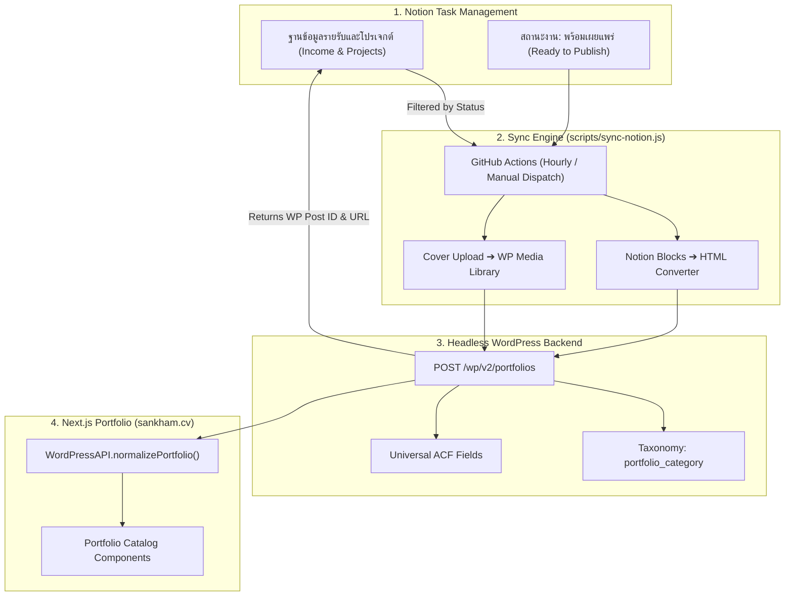

# Notion ➔ WordPress Data Mapping & Sync Architecture

This document describes how the **Notion Task Management Database**, **Headless WordPress REST API**, and **Next.js Portfolio Frontend** work together.

---

## 🏗️ 1. Architecture Overview



---

## 📊 2. Data Schema & Property Mapping Table

Every project in Notion maps directly to a WordPress `portfolios` post:

| Notion Property Name | Notion Type | WordPress Post Field | Description / Format |
| :--- | :--- | :--- | :--- |
| **`ชื่อโปรเจกต์ (Name)`** | `title` | `title` | Main title of the portfolio item |
| **`หมวดงาน (Category)`** | `multi_select` | `portfolio_category` | Array of WordPress Category IDs |
| **`Cover Image`** | `page.cover` | `featured_media` | Uploaded to WP Media Library; sets thumbnail ID |
| **Page Body (Blocks)** | `blocks` | `content` | Converted to clean HTML (headings, paragraphs, lists, embeds) |
| **`ลูกค้า/องค์กร (Client/NGO)`** | `relation` | `acf.client_name` | Resolved client/organization name |
| **`ระยะเวลางาน (Project Duration)`** | `date` | `acf.project_date` | Date or year of completion (`YYYY-MM-DD` or year) |
| **`เอกสาร (Documents)`** | `url` | `acf.external_url` | External project link, website URL, or video URL |
| **Page Body Summary** | `blocks` | `acf.project_description` | Short text overview snippet |
| **`WP Post ID`** | `number` | `id` | Saved back to Notion; prevents duplicates & enables updates |
| **`WP URL`** | `url` | `link` | Saved back to Notion; links to `https://www.sankham.cv/portfolio/slug` |

---

## 🏷️ 3. Category Taxonomy Mapping

The 13 categories in Notion map 1-to-1 with WordPress Category IDs and Frontend Slugs:

| Notion Category Name | WordPress Slug | WP Category ID |
| :--- | :--- | :--- |
| `ภาพถ่าย` | `photography` | `26` |
| `ถ่ายวีดีโอ` | `videography` | `24` |
| `ตัดต่อวีดีโอ` | `video-editing` | `23` |
| `เว็บไซต์` | `website` | `29` |
| `ออกแบบกราฟฟิก` | `graphic-design` | `28` |
| `นิทรรศการ` | `exhibition` | `25` |
| `สิ่งพิมพ์` | `print` | `27` |
| `แคมเปญ` | `campaign` | `30` |
| `โปรดิวเซอร์` | `producer` | `31` |
| `ไลฟ์สด` | `live-stream` | `51` |
| `อบรม` | `training` | `52` |
| `งานวิจัย` | `research` | `53` |
| `งานเขียน` | `writing` | `54` |

---

## 🎯 4. Simplified Universal ACF Schema

To eliminate friction, all portfolio items share a single **4-field universal ACF schema**:

```
Portfolio Universal Fields
├── client_name           (Text)      ➔ ลูกค้า / องค์กร
├── project_date          (Text)      ➔ วันที่ / ระยะเวลางาน
├── external_url          (URL)       ➔ ลิงก์โปรเจกต์ / ผลงาน
└── project_description   (Textarea)  ➔ คำอธิบายสรุป
```

---

## 🔄 5. Status Lifecycle & Sync Flow

1. **In Notion**: Change **`สถานะงาน (Work Status)`** to **`พร้อมเผยแพร่ (Ready to Publish)`** 🟦.
2. **Sync Execution**: GitHub Actions runs `scripts/sync-notion.js` automatically (or run `npm run sync-notion` manually).
3. **WordPress Post Creation / Update**:
   - If **`WP Post ID`** is empty in Notion ➔ Creates a new post.
   - If **`WP Post ID`** exists ➔ Updates the existing post without creating duplicates.
4. **Notion Completion**:
   - **`สถานะงาน (Work Status)`** updates to **`เผยแพร่แล้ว (Published)`** 🟩.
   - **`WP Post ID`** and **`WP URL`** are written back to the Notion card.

---

## 🔑 6. Required Environment Secrets

For GitHub Actions or local CLI sync, set the following environment variables:

| Variable Name | Description | Example Value |
| :--- | :--- | :--- |
| `NOTION_TOKEN` | Notion API Integration Secret | `ntn_3589...` |
| `NOTION_DB_ID` | Notion Projects Database ID | `28eb1417739e45299902fc338a7dd252` |
| `WP_URL` | WordPress REST API Base URL | `https://api.sankham.cv` |
| `WP_USER` | WordPress Admin Username | `visarutsankham` |
| `WP_PASS` | WordPress Application Password | `xxxx xxxx xxxx xxxx xxxx xxxx` |

---

## 💻 7. Frontend Data Normalization ([`src/lib/wordpress.ts`](file:///Users/lighthouse-control/Documents/visarut-portfolio-frontend/src/lib/wordpress.ts))

When the Next.js app fetches posts from WordPress, `WordPressAPI.normalizePortfolio(item)` transforms any category item into a unified model:

```typescript
export interface StandardizedPortfolio {
  id: number;
  slug: string;
  title: string;
  category: PortfolioCategory;
  date: string;
  meta: {
    clientName?: string;
    projectDate?: string;
    description?: string;
    externalUrl?: string;
  };
  featuredImage?: ImageMedia;
  galleryImages: ImageMedia[];
  videos: VideoMedia[];
  specs: Array<{ label: string; value: string }>;
  rawItem: PortfolioItem;
}
```
